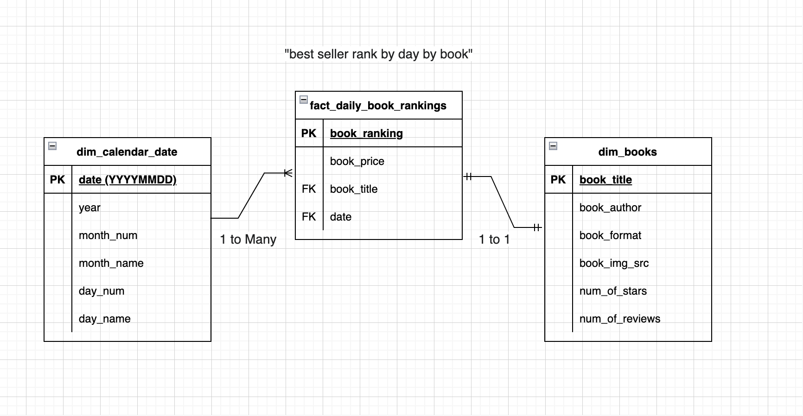
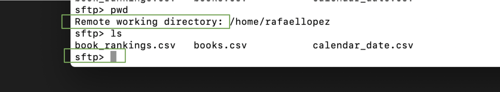
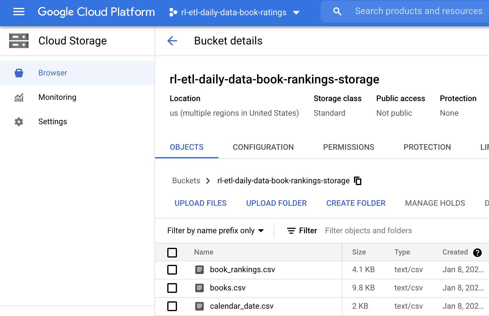
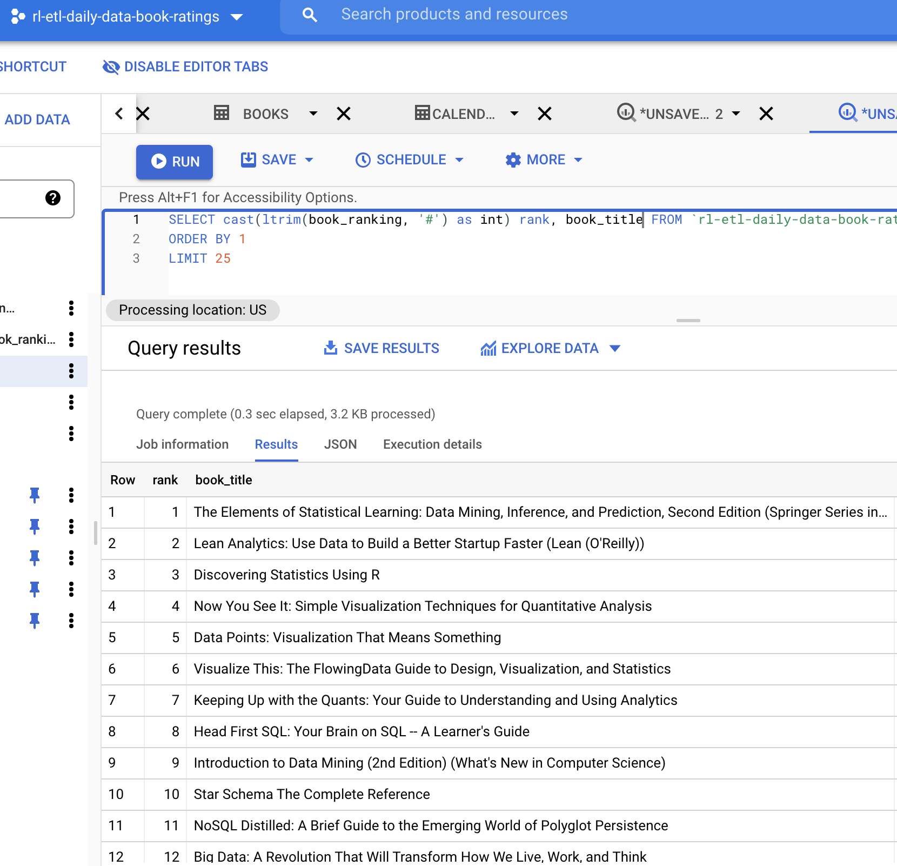

## ETL - Daily Top 50 Best Selling Big Data Books on Amazon

Disclaimer: This is an overkill architecture, there are simpler ways of doing this project using less tools but the purpose was to practice and learn using different tools and techniques. 

This project consists of:
- web scraping data from Amazon using Python's BeautifulSoup
- loading the data from my local machine to GCP using secure SFTP 
- working with Compute Engine VMs
- moving data within GCP from the VM to Cloud Storage
- creating a dimensional model (Kimball) with the data
- loading it to its final destination in BigQuery

### Data Modeling

### Transferring Files Securely To Remote Compute Engine VM with SFTP
Running `sftp rafaellopez@vm external ip` to connect to the remote instance then `put books.csv calendar_date.csv book_rankings.csv` to transferr local files to the remote system. 

### Loading Files from VM To Cloud Storage Bucket
Running `gsutil cp books.csv calendar_date.csv book_rankings.csv gs://rl-etl-daily-data-book-rankings-storage`

### BigQuery Tables Are The Final Destination

### Learnings
- I didnt really need to send files to the VM, I could have loaded files straight to Cloud Storage.
- Need to learn more about wiring within GCP and the different apis/services.
- This is a basic mock project so I didn't include automation for pulling data on a schedule but I plan to work on a more challenging project to include orchestration tools.